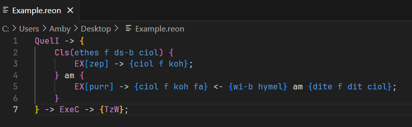
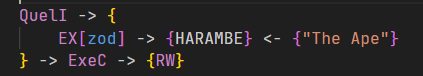

# reon-4213-syntax-highlighting README

This is the Syntax Highlighting extension for the fictional language REON-4213. This includes all the keywords except Proper Nouns.

## Features

As the name of the extension suggest, this provides syntax highlighting for the language. This does not include any sort of definition for words.

Control keywords include the EX block and V block:
- QuelI
- ExeC
- Execution Elements (TzW, RW, etc...)
- EX and other verb forms

Operator keywords include grammatical constructs and conjunctions.

Other keywords are the entire rest of the REON-4213 dictionary saves for the Proper Nouns.

A special feature of this language is the inclusion of strings. Strings can be used with a pair of double-quotes.

## Known Issues

About the Proper Noun thing, I don't know how to make it so that any word that you have fully capitalized become a Proper Noun, so it is not a thing.

# Release Notes:

## v1.0.1

Apparently I forgot to check VSCode version in the package.json

## v1.0.2

The issue with compound words with words as substring is that the words that matches later down the match list of the regex is not checked for.

Example: ih is placed before ih-p in the regex check group. So when looking for formatting pattern, only the "ih" of "ih-p" is marked. This is now fixed by changing the order of which the word is checked if it has an another word as its substring.